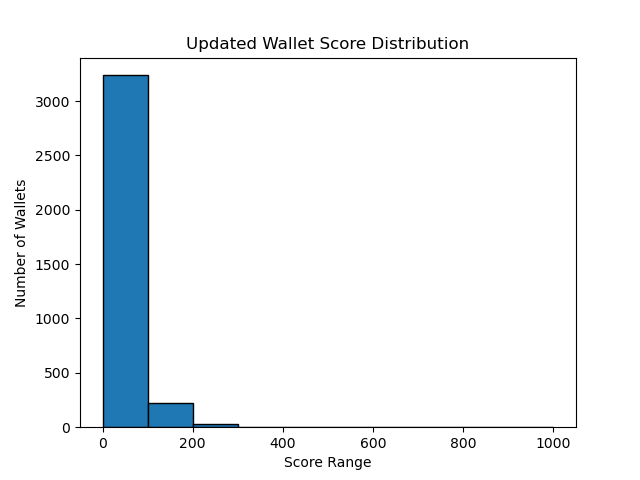

# **Aave V2 Wallet Credit Scoring – Analysis Report**

### **1. Objective**

To assign **credit scores (0-1000)** to each wallet based on historical transaction behavior on the Aave V2 protocol. Higher scores indicate more reliable and responsible usage patterns; lower scores reflect risky, bot-like, or exploitative behavior.

---

### **2. Score distribution plot**

```python
import pandas as pd
import matplotlib.pyplot as plt

scores = pd.read_csv("wallet_scores.csv")

plt.figure(figsize=(10,6))
plt.hist(scores['score'], bins=range(0,1100,100), edgecolor='black')
plt.title("Wallet Credit Score Distribution")
plt.xlabel("Score Range")
plt.ylabel("Number of Wallets")
plt.xticks(range(0,1100,100))
plt.grid(axis='y')
plt.tight_layout()
plt.savefig("score_distribution.png")
plt.show()
```
<p align="center">
  
</p>
This histogram visualises the spread of wallet scores across the defined ranges.

### **3. Behavioral insights**
- Wallets in 0-100 range
  
- Frequent liquidation calls.

- Low or zero repayment-to-borrow ratios.

- High borrow amounts relative to deposits.

- Bot-like interaction patterns (e.g., extreme transaction frequency without meaningful deposit or repayment).

- Wallets in 900-1000 range
  
- High total deposits and consistent deposit frequency.

- Healthy repayment-to-borrow ratios (often >0.8).

- No liquidation calls triggered by or against them.

- Diversified asset usage, indicating strategic and balanced engagement with the protocol.

### **4. Key interpretations**

- High scores (700-1000): Indicate responsible users with balanced borrowing, timely repayments, and strategic asset management, reducing systemic risk.

- Mid scores (400-700): Users with mixed behaviour: active usage but occasional risky transactions or suboptimal repayment consistency.

- Low scores (0-400): Potential bots, exploiters, or wallets demonstrating default-prone behaviour with high liquidation frequencies.

### **5. Limitations & Future Enhancements**

- No external creditworthiness data integrated.

- USD normalisation absent (due to lack of historical price mapping here).

- Weights are based on intuitive domain logic; future iterations should calibrate these via supervised learning with labelled default/non-default outcomes if available.

### **6. Conclusion**
The current scoring pipeline establishes a transparent, explainable, and extensible baseline model to assess DeFi wallet creditworthiness. It can be adapted to integrate price feeds, chain-level risk data, and supervised risk prediction models for production deployment.
